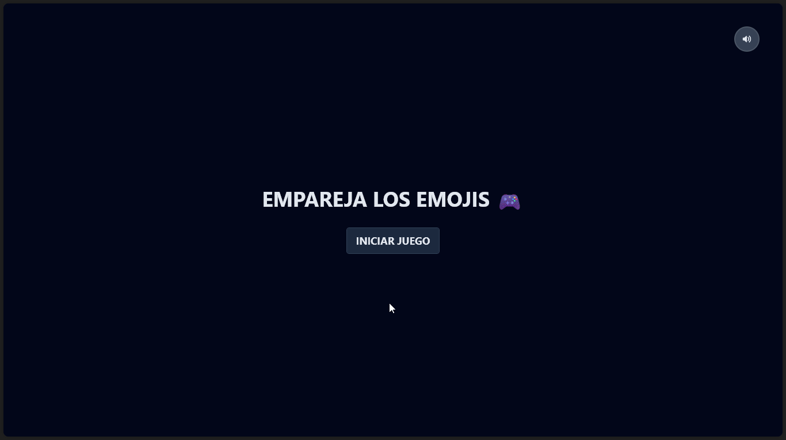
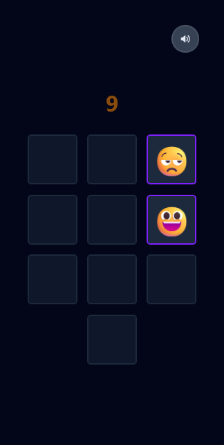
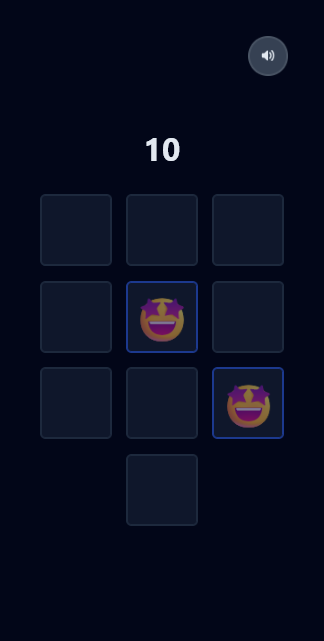

# Emoji Game

A React implementation of a concentration game based on the one proposed by the content creator [Joy of Code](https://youtu.be/w2q9caYXgkg?si=XmXt3IsLfibNX8GO)

## Demo

Note that the game has sounds, if you want to see the full functionality you can run it locally




## Mobile Screenshots







## Run Locally

Clone the project

```bash
  git clone https://github.com/JDCodeWork/emoji-game.git
```

Go to the project directory

```bash
  cd emoji-game
```

Install dependencies

```bash
  npm install
```

Start the development server

```bash
  npm run dev
```